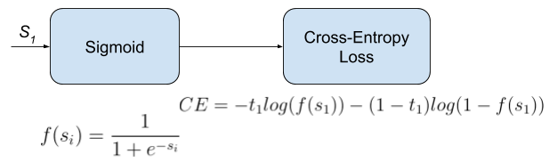

# Logistic Regression

Logistic regression is a supervised learning algorithm used for binary classification tasks. Logistic Regresseion outputs probabilities and maps them to class labels of 0 or 1, using the sigmoid activation function.

The sigmoid activation function maps any real-valued number to a value between 0 and 1. This makes it suitable for interpreting outputs as probabilities. The model first computes a linear combination of the input features, and applies the sigmoid to produce a probability.


The model learns best fitting parameters (weights and bias) by minimizing a binary cross-entropy loss using gradient descent. By penalizing the incorrect confident predictions more heavily than uncertain ones, the binary cross entropy loss is used to measure how well the model's predictions match the true labels.

## Application ##
We apply logistic regression to a binary classification problem. 
The used dataset is the heart disease dataset from earlier that we will be using to predict if a patient has a heart disease based on the `thalach` feature, or maximum heart rate.

### Dependencies
```bash
pip install numpy pandas matplotlib seaborn scikit-learn mlxtend
