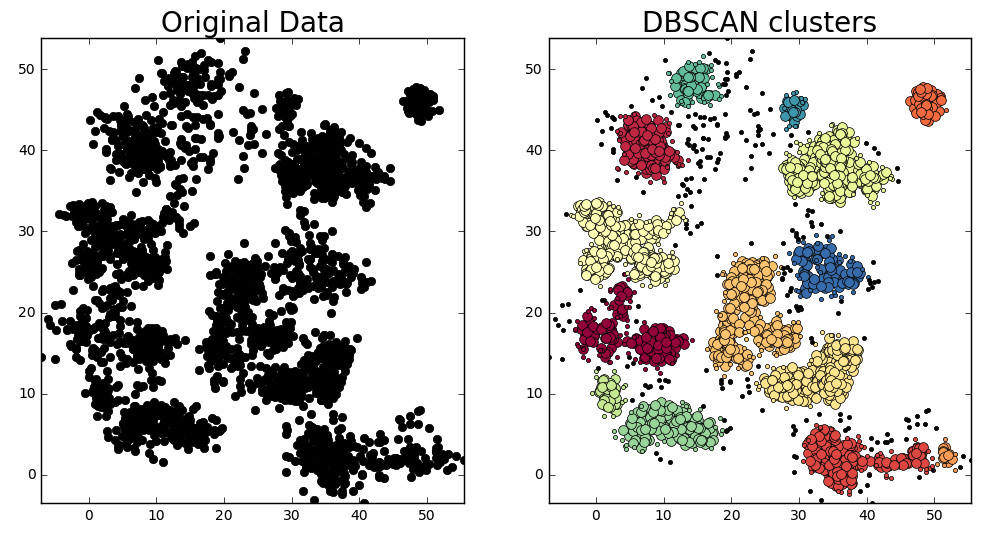

# DBSCAN Algorithm
DBSCAN (Density-Based Spatial Clustering of Applications with Noise) is a data clustering algorithm that groups closely packed data points into clusters, identifying outliers as noise.
DBSCAN finds clusters based on the density of data points within a specified radius (epsilon). An advantage of DBSCAN is that it doesn't require specifying the number of clusters beforehand.



## Application

The used dataset is publicly available on Kaggle.com and it is customers records from a groceries firm's database that was used for a marketing campaign. 


Key parts in the implementation of the algorithm include:
- Preprocess the data
- Apply DBSCAN clustering
- Visualizing the clusters using dimension reduction through PCA

DBSCAN successfully segmented customers into clusters based on purchasing behavior and engagement.
Noise points (with cluster label -1) were identified, representing outliers in the dataset.
PCA visualization clearly showed the separation between dense regions and noisy regions.

### Dependencies 
Install libraries:
```bash
pip install pandas numpy matplotlib scikit-learn
